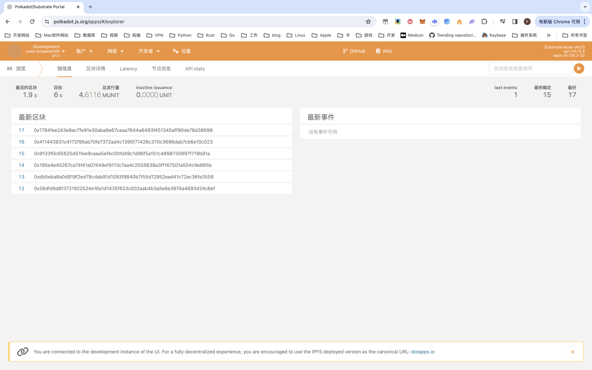
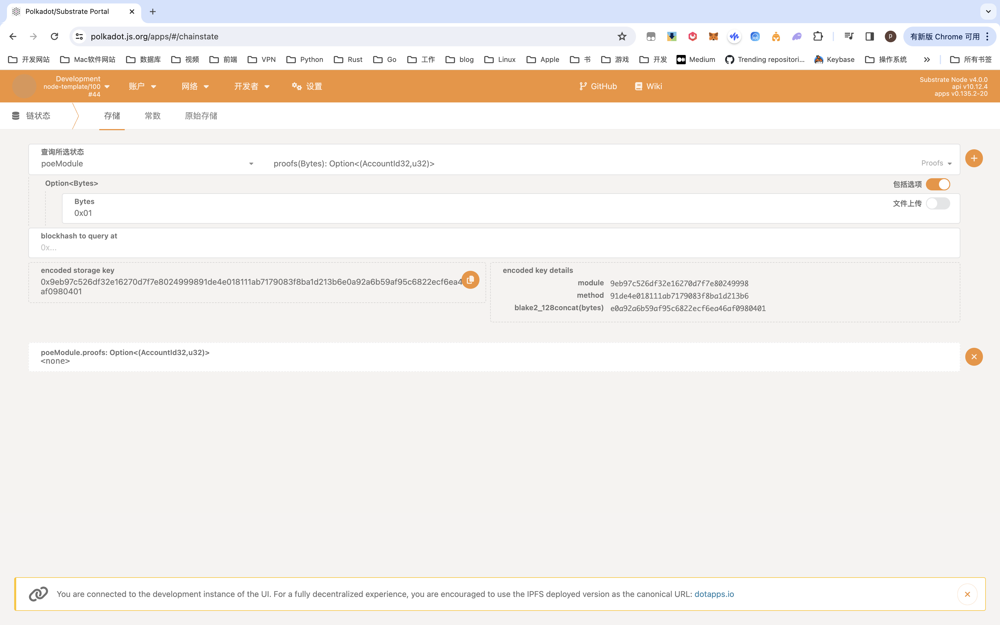
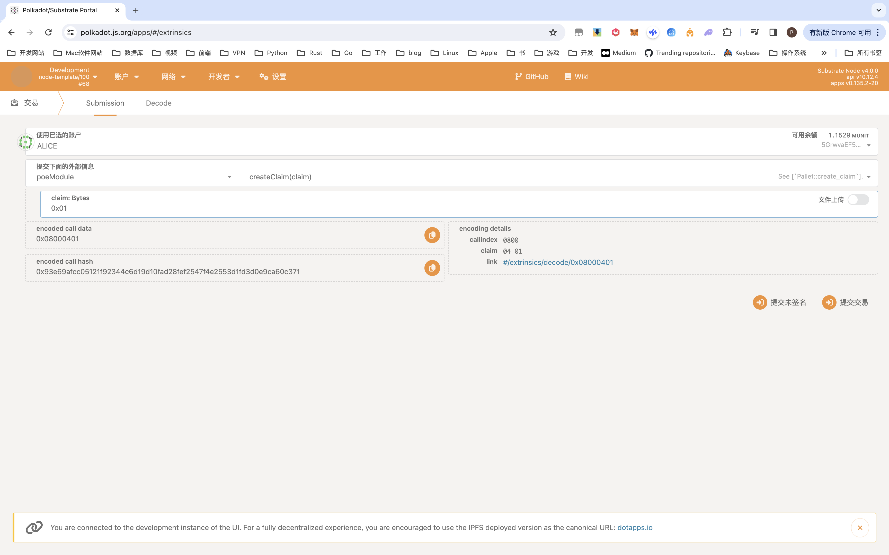
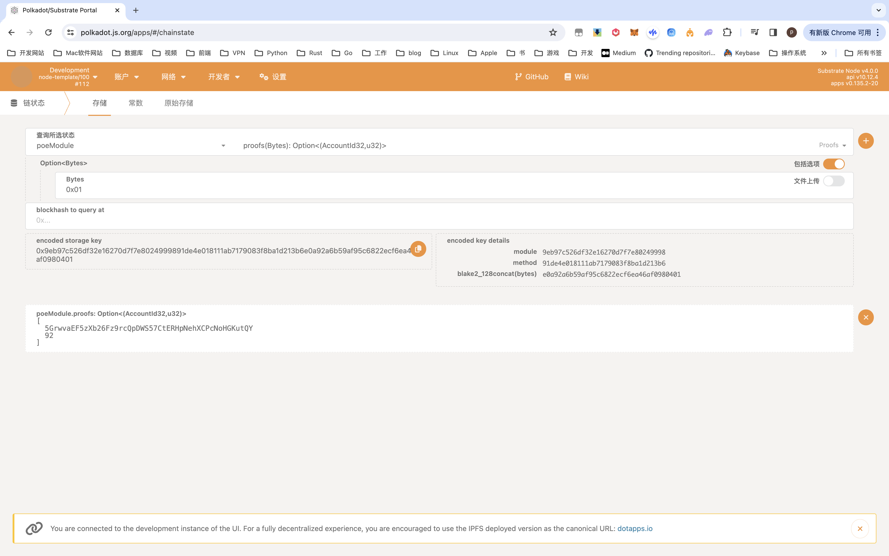
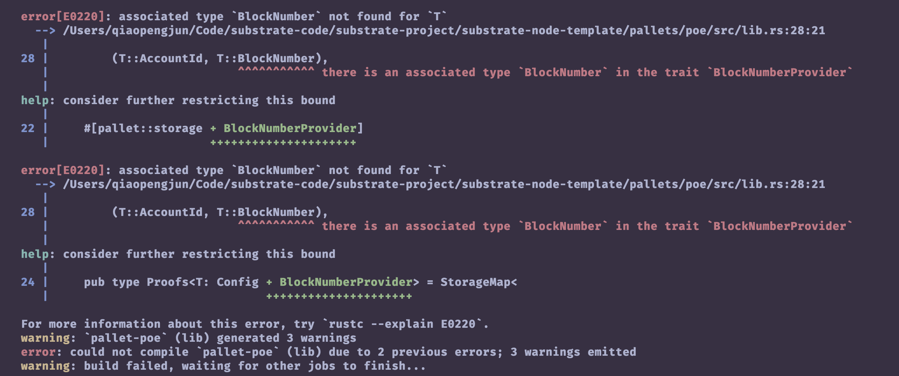

# Hands-on Coding Notes

## Substrate 区块链应用开发 存证模块的功能开发

存证是一种在线服务，可用于在某一时间点验证计算机文件的存在性，最早是通过比特币网络带有时间戳的交易实现的。
存证的应用场景有：

- 数字版权
- 司法存证
- 供应链溯源
- 电子发票
- ...

存证的作用是：

- 证明文件在某一时间点确实存在
- 证明文件在某一时间点确实没有被篡改
- 证明文件在某一时间点确实由某个人创建

## 实操

1. Open a terminal shell on your computer.

2. Clone the node template repository by running the following command:

```sh
git clone https://github.com/substrate-developer-hub/substrate-node-template
```

3. Change to the root of the node template directory by running the following command:

```sh
    cd substrate-node-template
```

4. Create a new branch to contain your work:

```sh
    git switch -c my-learning-branch-2024-04-05
```

5. Compile the node template by running the following command:

```sh
    cargo build --release
```

6. In the same terminal where you compiled your node, you can now start the node in development mode by running the following command:

```sh
    ./target/release/node-template --dev --tmp
```


7. polkadot.js.org/apps 查看


8. 交易前查询状态 None


9. 交易


10. 提交交易


11. 交易后查询状态


## 问题

1. 编译报错后使用的命令

```sh
    cargo clean
    cargo update
    cargo update -p wasm-bindgen
    cargo update -p librocksdb-sys
    cargo update -p schnorrkel@0.11.4
    cargo update -p anstream@0.6.13  -Z sparse-registry    
```

2. 编译报错：error[E0220]: associated type `BlockNumber` not found for `T`


解决： 替换`T::BlockNumber`为`BlockNumberFor<T>`

- <https://substrate.stackexchange.com/questions/9848/associated-type-blocknumber-not-found-for-t>

## 参考

- <https://docs.substrate.io/tutorials/build-a-blockchain/build-local-blockchain/>
- <https://substrate.stackexchange.com/questions/9848/associated-type-blocknumber-not-found-for-t>
- <https://polkadot.js.org/apps>
